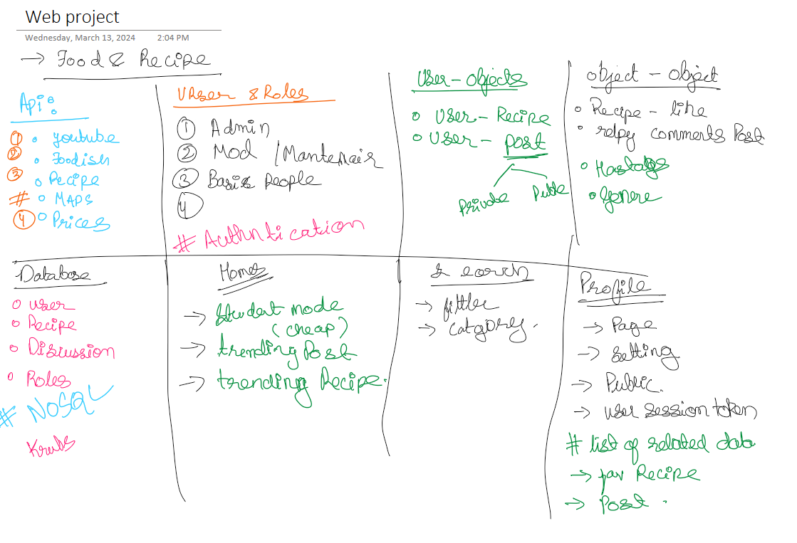

# Web Dev CS5160 : Project
## Tittle: Food Recipe Web Site / Social Media 

This project involves developing a website focused on culinary exploration, incorporating features such as recipe search functionalities augmented with cruise-based recommendations (e.g., prioritizing recipes akin to a culinary adventure or hidden gem). Additionally, the platform facilitates user interaction through group formation, recipe sharing, and social engagement.

Furthermore, the website aims to integrate restaurant recommendations tailored to specific cruise experiences. Additionally, it will include a student mode feature, offering suggestions for budget-friendly yet satisfying dining options, including quick and convenient meals suitable for busy schedules.

### Developers:
 - [Ankit Sinha](https://github.com/Ank-22)  
 - [Eric Nguyen](https://github.com/enguyen11)
 - [Suraj Mishra](https://github.com/sm5689)
 - [Parwaz Singh](https://github.com/Parwazsingh) 

 ## Ideation/planing:
