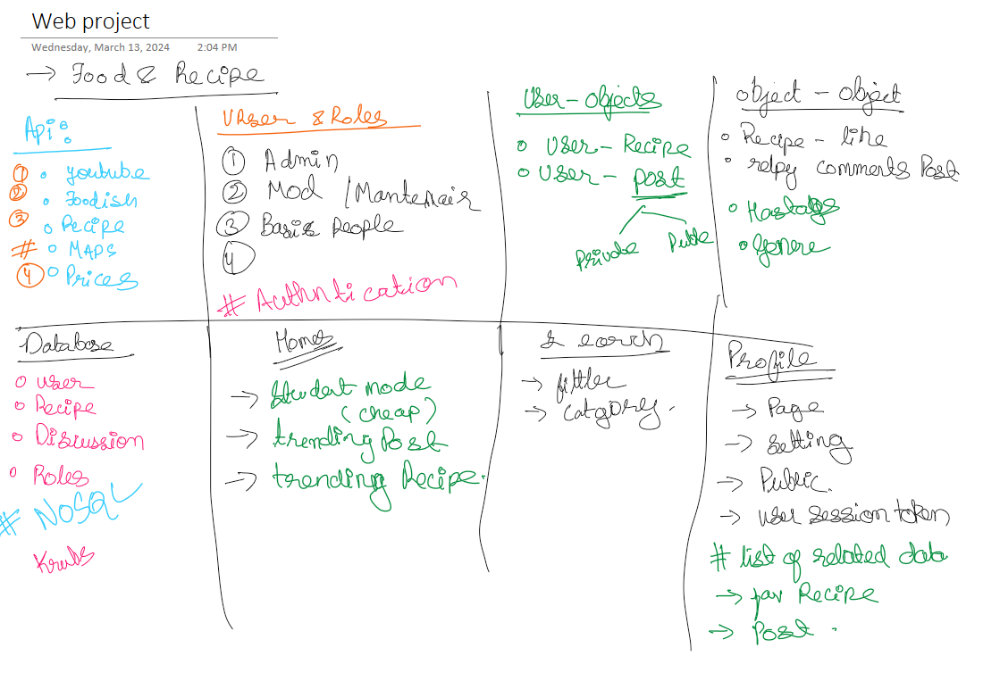
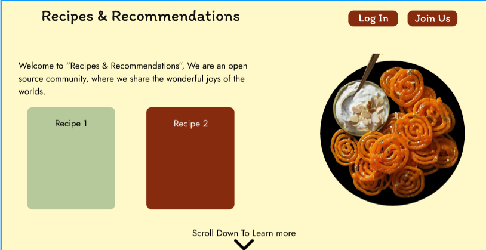

# Web Dev CS5610: Food Recipe & Social Media Website 🍲

## Project Title: Food Recipe & Social Media Platform

This project is a web application dedicated to culinary enthusiasts, combining features of a recipe website and a social media platform. It allows users to discover recipes, engage with others, and receive curated restaurant recommendations tailored to diverse dining experiences. Whether you’re looking for a quick meal suggestion or embarking on a culinary journey, this site aims to enhance your food discovery and sharing experience.

### Key Features
- **Recipe Search and Discovery**: Users can explore a variety of recipes with tailored recommendations based on unique themes like hidden gems, global cuisines, or regional delicacies.
- **Social Interaction**: Users can form groups, share recipes, comment, and like each other’s posts, creating a community centered around food.
- **Cruise-based Restaurant Recommendations**: A unique feature where users receive restaurant recommendations based on specific cruise experiences.
- **Student Mode**: A dedicated section for students, offering budget-friendly meal options and convenient recipes ideal for busy schedules.

---

### Developers
- [Ankit Sinha 🤟🏻](https://github.com/Ank-22)  
- [Eric Nguyen 😎](https://github.com/enguyen11)
- [Suraj Mishra ☀️](https://github.com/sm5689)
- [Parwaz Singh 😄](https://github.com/Parwazsingh) 

---

## Project Ideation and Planning

### Color Palette
We chose a color palette that evokes nature and earthiness, associated with fresh ingredients and natural culinary aesthetics.  
Palette Link: [Color Hunt Palette](https://colorhunt.co/palette/b5c99a862b0dfff9c9ffc95f) 

### UI Concept
The UI is designed to provide a unique, book-style interface with smooth scroll effects, integrating a **parallax effect** for immersive navigation:
- **Recipe Presentation**: Each recipe is displayed in a unique “page” format, where users can scroll through recipes as if flipping through a cookbook.
- **User Interactions**: Commenting on a recipe triggers an overlay resembling a piece of paper, bringing up all interactions associated with the recipe.

#### Landing Page (Prototype)

### Fonts in Consideration
The handwritten style fonts aim to add a personal touch, making users feel at home in the culinary community:
- [Pangolin](https://fonts.google.com/specimen/Pangolin?classification=Handwriting)
- [Patrick Hand](https://fonts.google.com/specimen/Patrick+Hand?classification=Handwriting)
- [Edu NSW ACT Foundation](https://fonts.google.com/specimen/Edu+NSW+ACT+Foundation?classification=Handwriting)

---

## Project Milestones

### Objective for April 7, 2024
#### Primary Goals
- Begin UI coding
- Set up MongoDB database for recipe and user data
- Explore and implement the parallax effect

#### Secondary Goals
- Experiment with external APIs for potential recipe and restaurant data integrations

---

Feel free to reach out to any of the contributors listed above for more information or contributions to the project. 

---

Happy Cooking and Coding! 😊
